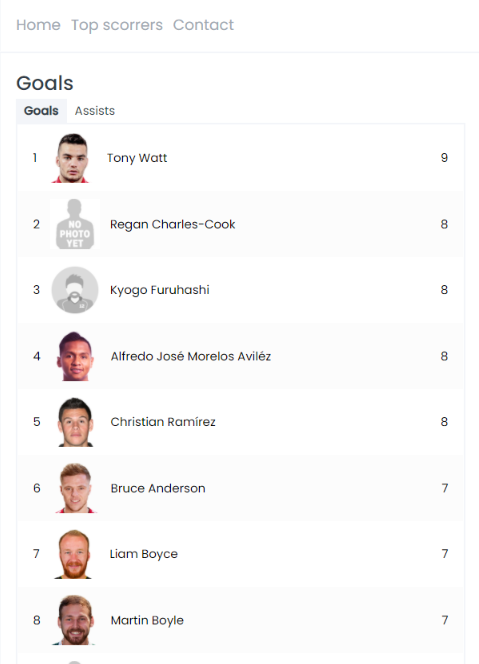

# Scottish League

Informations about Scottish Premiership: standings, latest matches, topscorers

Created with: React, Typescript
React related libraries: styled-components, react-router-dom

## Views:
### home page:

### home page (mobile):

### details:

### details (mobile):

### topscorers:

### topscorers (mobile):

### not found:
